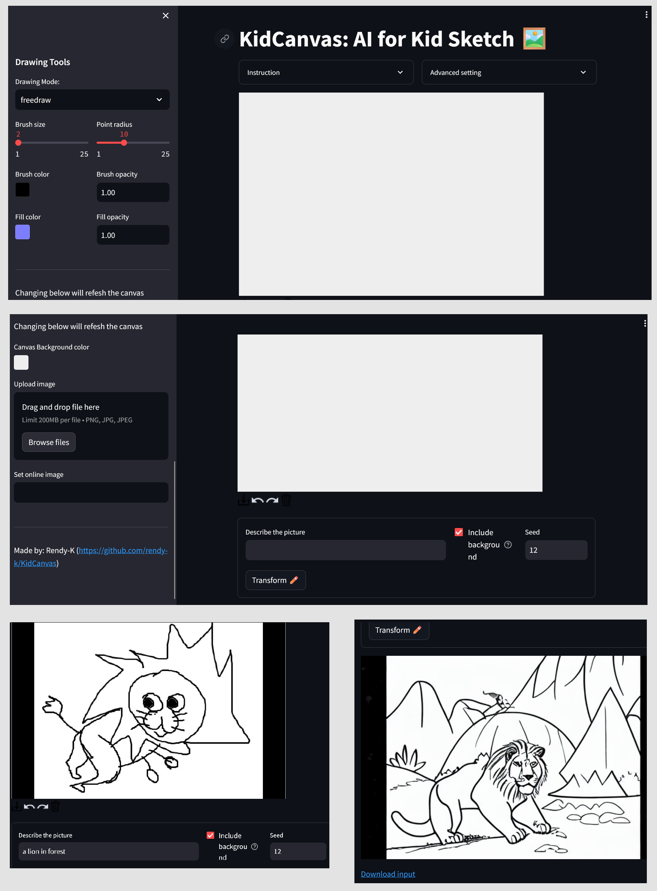

# KidCanvas
KidCanvas: AI for Kid Sketch

This application receives a sketch image (from a kid) and transforms it to be a more proper image.

It uses Generative AI: image generator/Diffuser as the model.

# How to install the requiretments
Run the command `pip install -r requirements.txt`

# How to run the app
Run the command `streamlit run kidcanvas.py`

# Application display

# Application deployed link
https://kidcanvas-rendy-k.streamlit.app/
(may fail in running the model (after clicking the "Transform" button) due to lack of computing resources.)
